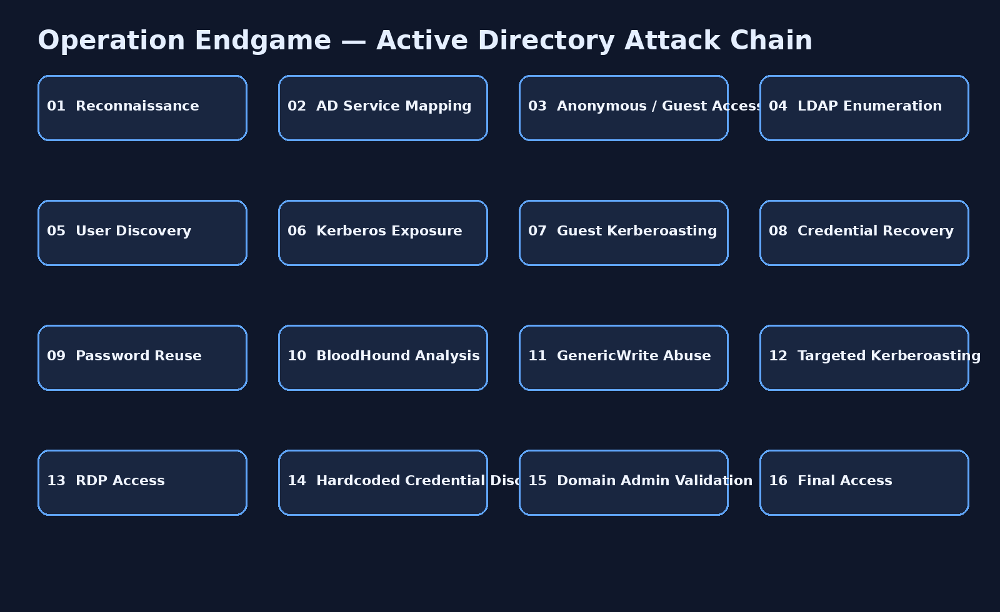

# 🐍 Operation Endgame — TryHackMe CTF Walkthrough

<p align="center">
  
</p>

<p align="center">
  
  
  
  
</p>

<p align="center">
  
  
  
  
</p>

---

## 📌 Overview

**Operation Endgame** is an Active Directory-focused TryHackMe challenge built around weak identity controls, anonymous/Guest exposure, LDAP information disclosure, Kerberos attack surfaces, password reuse, BloodHound relationship analysis, targeted Kerberoasting, RDP access, and hardcoded privileged credentials.

This repository presents the room as an evidence-driven penetration-testing case study and documents the full compromise path to Domain Administrator.

> **Public flag policy:** challenge flags and answer-only secrets are intentionally redacted.

---

## 🎯 Objectives

- Identify a Windows Domain Controller from network services.
- Enumerate valid domain accounts through Kerberos.
- Validate null-session and Guest exposure.
- Extract Active Directory information through LDAP.
- Assess AS-REP roasting.
- Obtain a Kerberos service ticket through Guest access.
- Crack a service-account Kerberos hash.
- Test credential reuse with controlled password spraying.
- Analyze ACL relationships with BloodHound.
- Abuse `GenericWrite` to enable targeted Kerberoasting.
- Recover a second credential set from a service account.
- Obtain RDP access and inspect local administrative resources.
- Discover hardcoded domain credentials in a PowerShell script.
- Validate Domain Administrator privileges.

---

## 🧠 Skills Demonstrated

| Domain | Techniques |
|---|---|
| Reconnaissance | RustScan, Nmap, service fingerprinting |
| Active Directory | LDAP, Kerberos, SMB, RPC, RDP |
| Enumeration | `kerbrute`, `enum4linux`, `ldapsearch`, NetExec |
| Credential Access | AS-REP roasting, Kerberoasting, Hashcat |
| Password Attacks | Controlled password spraying, password reuse analysis |
| AD Attack Paths | BloodHound, ACL relationship analysis |
| Exploitation | GenericWrite abuse, targeted Kerberoasting |
| Windows Post-Exploitation | RDP, PowerShell inspection |
| Privilege Analysis | Domain Admin validation |
| Reporting | Attack-chain mapping, findings, remediation |

---

## ⚙️ Lab Information

| Property | Value |
|---|---|
| Platform | TryHackMe |
| Room | Operation Endgame |
| Environment | Active Directory |
| Domain | `thm.local` |
| Target Role | Domain Controller |
| Difficulty | Hard |
| Assessment Type | Authorized CTF Laboratory |

---

## 🛠️ Tools Used

| Tool | Purpose |
|---|---|
| **RustScan** | Full TCP discovery |
| **Nmap** | Service and version enumeration |
| **Kerbrute** | Kerberos user enumeration and password spraying |
| **ldapsearch** | LDAP/domain information retrieval |
| **enum4linux** | SMB/domain enumeration |
| **NetExec** | SMB/LDAP validation and Kerberoasting |
| **Impacket** | Kerberos/AD interaction |
| **Hashcat** | Kerberos hash cracking |
| **BloodHound** | AD relationship and attack-path analysis |
| **xfreerdp3** | RDP access |
| **PowerShell** | Windows host inspection |

---

# 🔍 Attack Methodology

<p align="center">
  
</p>

```text
Reconnaissance
      ↓
AD Service Enumeration
      ↓
Anonymous / Guest Discovery
      ↓
LDAP Information Disclosure
      ↓
User Discovery
      ↓
Kerberos Attack-Surface Assessment
      ↓
Guest Kerberoasting
      ↓
Credential Recovery
      ↓
Password Reuse
      ↓
BloodHound Attack-Path Analysis
      ↓
GenericWrite Abuse
      ↓
Targeted Kerberoasting
      ↓
RDP Access
      ↓
Hardcoded Credential Discovery
      ↓
Domain Administrator Validation
```

---

# 🗂️ Repository Structure

```text
Operation-Endgame-TryHackMe-Walkthrough/
│
├── README.md
├── _config.yml
│
├── Documentation/
│   ├── THM_Operation_Endgame_Documentation.md
│   ├── THM_Operation_Endgame_Report.docx
│   └── README.md
│
├── Resources/
│   ├── notes.md
│   ├── payloads.md
│   ├── tools.md
│   ├── references.md
│   └── remediation.md
│
├── docs/
│   ├── index.md
│   └── assets/
│       ├── attack-chain.png
│       ├── figure-1-bloodhound-genericwrite.png
│       ├── figure-2-bloodhound-domain-admins.png
│       ├── figure-3-room-completion.png
│       └── css/
│           └── custom.scss
│
└── Screenshots/
    ├── figure-1-bloodhound-genericwrite.png
    ├── figure-2-bloodhound-domain-admins.png
    └── figure-3-room-completion.png
```

---

# 🛡️ Security Findings

| Finding | Severity |
|---|---|
| Anonymous/Guest Active Directory exposure | High |
| Excessive LDAP disclosure | High |
| Kerberoastable service account | High |
| Weak/reused credentials | High |
| `GenericWrite` relationship enabling credential attack path | Critical |
| Hardcoded privileged credentials in PowerShell | Critical |
| Domain Administrator compromise | Critical |

---

# 🖼️ Evidence

The repository uses the supplied screenshots as genuine technical evidence:

- **Figure 01** — `ZACHARY_HUNT` has `GenericWrite` over `JERRI_LANCASTER`.
- **Figure 02** — `SANFORD_DAUGHERTY` is associated with `DOMAIN ADMINS` and the domain controller.
- **Figure 03** — TryHackMe Operation Endgame room completion.

The attack-chain graphic is conceptual and is not presented as target evidence.

---

# 🚩 Flag Policy

```text
Final Flag → [FLAG REDACTED]
```

---

# 📖 Documentation

- [Complete Technical Walkthrough](Documentation/THM_Operation_Endgame_Documentation.md)
- [Professional Word Report](Documentation/THM_Operation_Endgame_Report.docx)
- [GitHub Pages Case Study](docs/index.md)
- [Technical Notes](Resources/notes.md)
- [Remediation](Resources/remediation.md)

---

# ⚠️ Disclaimer

This repository documents exploitation performed inside an authorized TryHackMe training environment.

Do not use these techniques against systems without explicit authorization.

---

# 👨‍💻 Author

## **Anurag Ravankar**

Cybersecurity • Active Directory • Penetration Testing • Security Research
